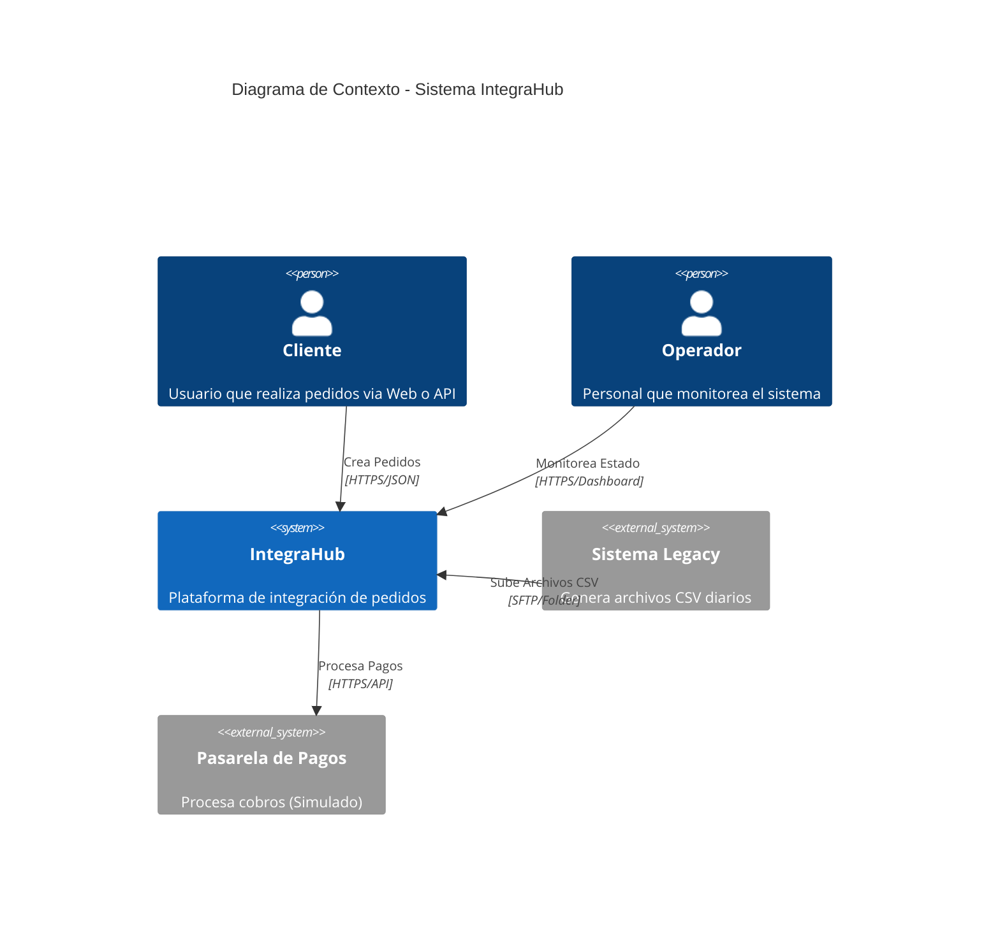
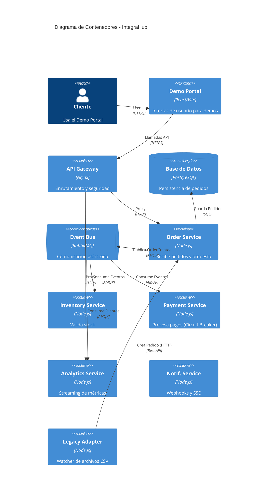
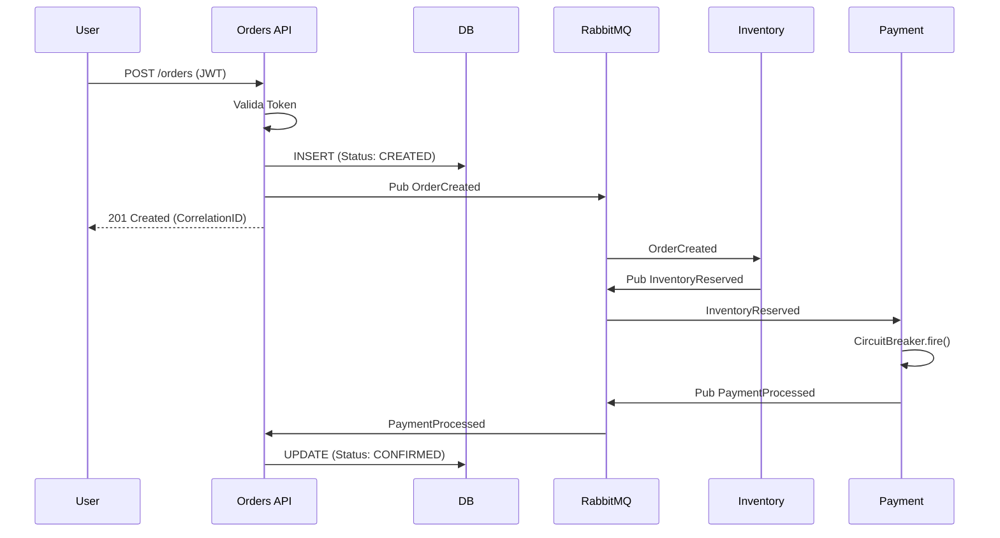
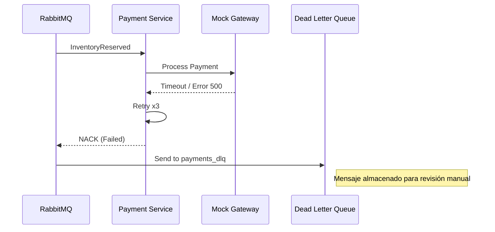

# Diagramas de Arquitectura y Flujo (Evidencias)

## 1. Diagrama C4 - Nivel Contexto

## 2. Diagrama C4 - Nivel Contenedor

## 3. Diagrama de Secuencia: Create Order (E2E)

## 4. Diagrama de Secuencia: Fallo + DLQ

